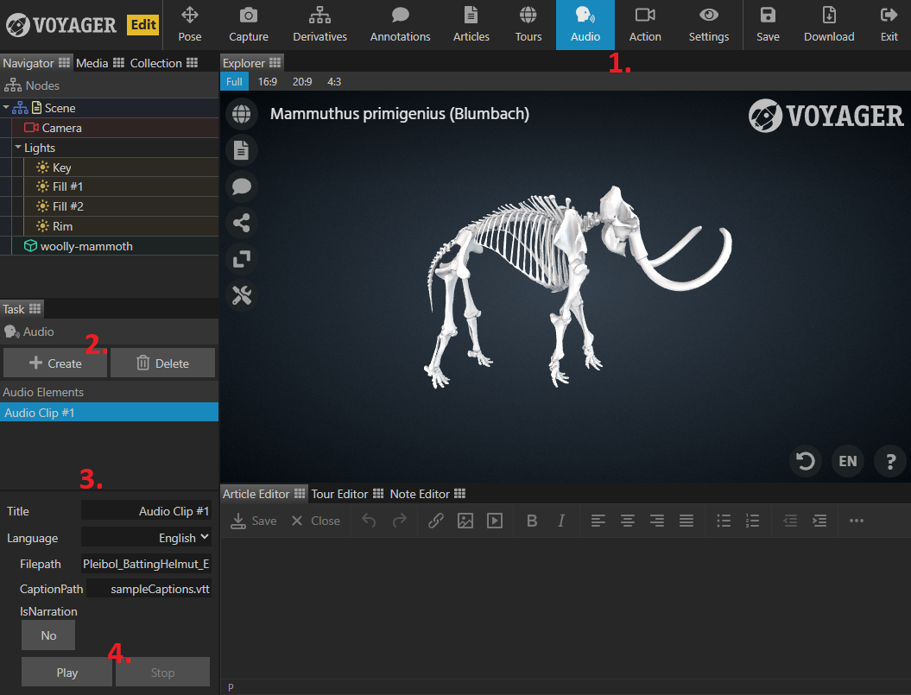

Use the Audio Task to load and test audio clips for use elsewhere (narration, annotations, etc.) in the scene.

**Note:** Audio files **must be .mp3** format. Currently, this is the only audio format that has cross-browser compatibility.

1. Select the {} Task in the task bar. 
2. Click Create in the task panel to make a new audio element or select an existing one to edit.
3. Set the audio details as follows:
    - **Title** - The name that will identify the clip in the Story UI.
    - **Language** - Change this to add alternate language audio clips for multilingual support.
    - **Filepath** - Drag and drop your audio file here.
    - **CaptionPath** - Drag and drop your caption file (.vtt) here to enable accessible audio content.
    - **IsNarration** - Set this to Yes to make this clip the global audio narration. Only one clip can have this designation. If another clip is already set, this option will appear disabled.
4. Test the audio clip by using the Play and Stop buttons.

This clip is now ready and available for use in the scene!

